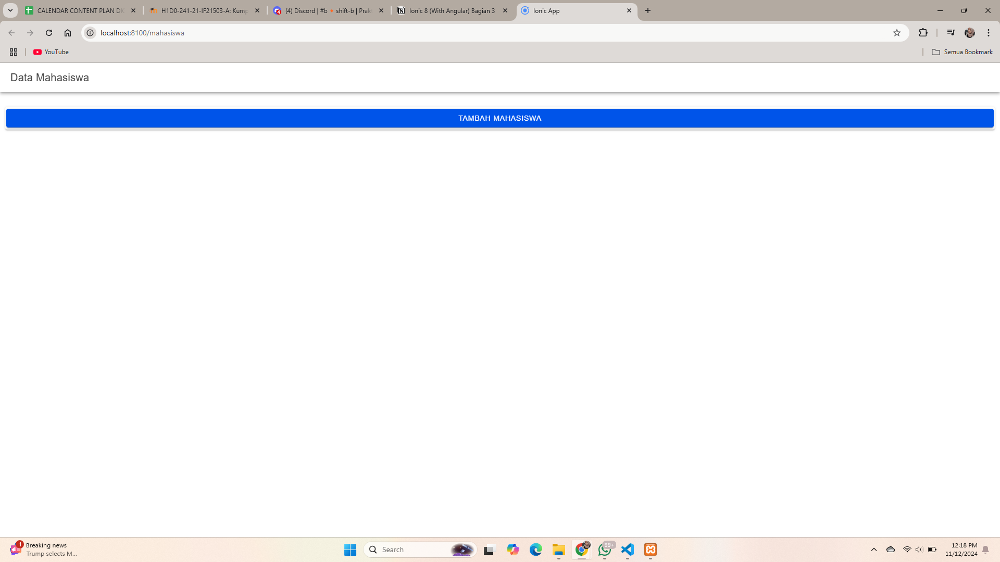
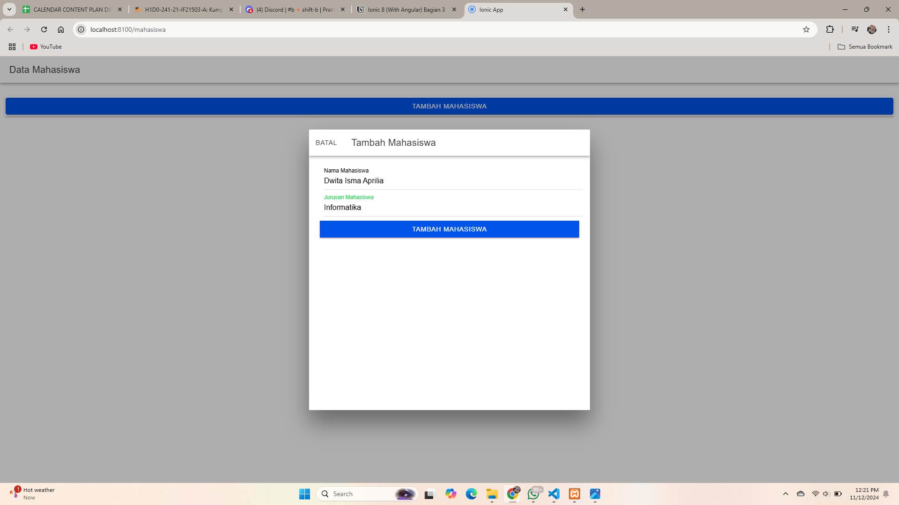
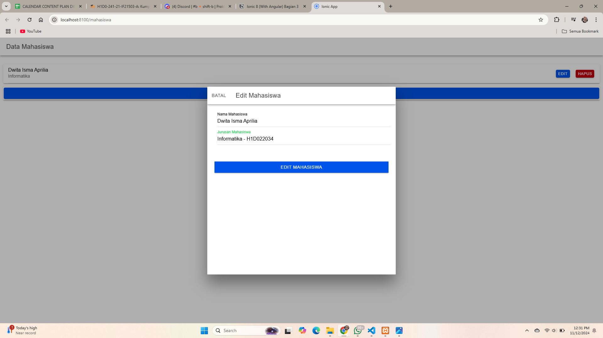
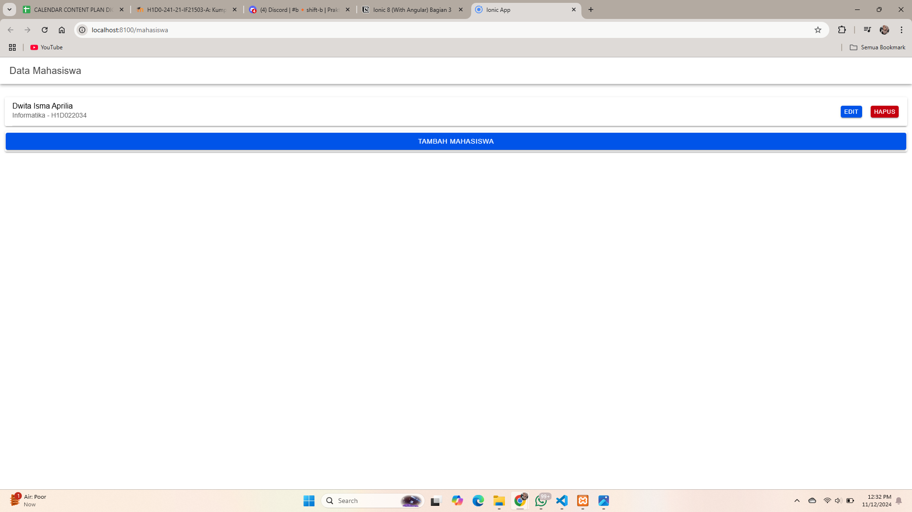
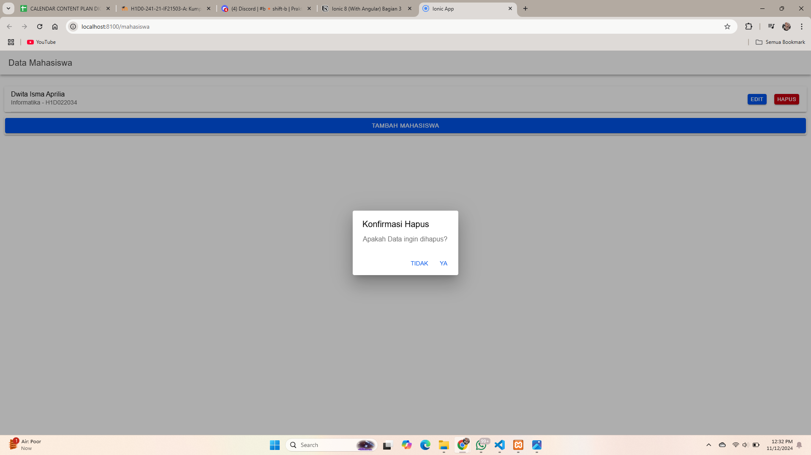

## Halaman Tampilan Awal

## Halaman Tampilan Tambah Mahasiswa

Fungsi tambahMahasiswa ini merupakan agian dari operasi Create dalam CRUD, yang mengirim data baru ke server untuk ditambahkan. Langkah-langkah utama yang dilakukan adalah:
1. Memvalidasi data input
2. Menyiapkan data mahasiswa dalam bentuk objek
3. Mengirim data ke server dengan metode POST
4. Menanggapi respons server untuk mengonfirmasi keberhasilan atau kegagalan penambahan data

Fungsi ini juga diintegrasikan dengan antarmuka pengguna untuk menutup modal dan memperbaharui daftar data mahasiswa setelah penambahan berhasil.

## Halaman Tampilan Setelah Tambah Mahasiswa

## Halaman Tampilan Edit Mahasiswa

## Halaman Tampilan Setelah Edit Mahasiswa

## Halaman Tampilan Hapus Mahasiswa

